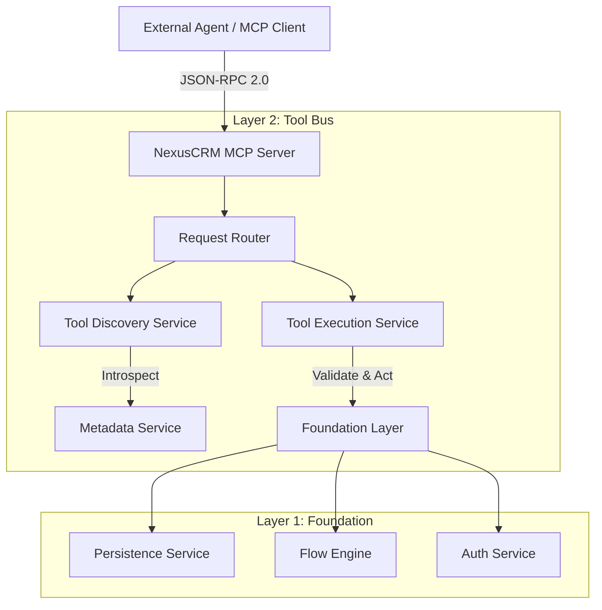

# Technical Design Doc: NexusCRM Agent Platform (Layer 1 & 2)

## 1. Introduction
This document defines the technical architecture for transforming NexusCRM into an **Agent-Native Platform**. The core component is an **MCP (Model Context Protocol) Server** that exposes the CRM's dynamic metadata and business logic as standardized Tools for external AI agents (Cursor, Claude, etc.).

## 2. System Architecture



## 3. Component Design

### 3.1 MCP Server (`pkg/mcp`)
*   **Role**: Entry point for AI interactions.
*   **Protocol**: JSON-RPC 2.0 over HTTP (SSE) or Stdio.
*   **Dependencies**: None (Pure Go stdlib preferred).
*   **Key Interfaces**:
    *   `ServeHTTP(w, r)`: Handles SSE connections.
    *   `HandleMessage(msg)`: Routes JSON-RPC messages.

### 3.2 Dynamic Tool Bus (`internal/application/services/tool_bus`)
*   **Role**: Live projection of metadata into Tool Definitions.
*   **Behavior**: Stateless. Re-generates definitions on every `tools/list` request to ensure 100% consistency with runtime schema.
*   **Tool Mapping Strategy**:
    *   **Objects**: `_System_Object` entries → `create_<Obj>`, `update_<Obj>`, `search_<Obj>`.
    *   **Fields**: `_System_Field` entries → JSON Schema properties.
    *   **Validation**: Uses `ValidationService` rules (Regex, Required) in the generated JSON Schema.

### 3.3 Introspection Capabilities
To support "Dynamic Discovery", the Bus validates usage of specific Meta-Tools:
*   `list_tools(filter_string)`: Returns subset of tools matching string.
*   `get_object_schema(object_name)`: Returns full field definitions for an object.
*   `search_knowledge(query)`: Semantically searches `_System_Knowledge` (Planned Feature).

## 4. API Specification (MCP Mapping)

### Resource: `tools/list`
**Request**: `{ "method": "tools/list" }`
**Response**:
```json
{
  "tools": [
    {
      "name": "create_Account",
      "description": "Create new Account record",
      "inputSchema": { ... }
    },
    {
      "name": "describe_object",
      "description": "Get schema for an object",
      "inputSchema": { "properties": { "name": { "type": "string" } } }
    }
  ]
}
```

### Resource: `tools/call`
**Request**: 
```json
{ 
  "method": "tools/call", 
  "params": { 
    "name": "create_Account", 
    "arguments": { "Name": "Acme Inc" } 
  } 
}
```
**Execution Flow**:
1.  **Auth Check**: Validate Bearer Token → `UserContext`.
2.  **Permission Check**: `PermissionService.CanCreate("Account")`.
3.  **Persistence**: `PersistenceService.Create("Account", data)`.
4.  **Audit**: Log to `_System_ToolCall`.
5.  **Response**: Return Record ID or Error Rule violation.

## 5. Security Design

### 5.1 Authentication
*   **Transport**: HTTP Header `Authorization: Bearer <JWT_TOKEN>`.
*   **Identity**: Token maps to standard `_System_User` via `requireAuth` middleware.
*   **Context**: All L1 service calls (`PersistenceService`, etc.) are wrapped in `UserContext` derived from the token.

### 5.2 Authorization (FLS/OLS)
The Tool Bus explicitly enforces permissions **before** calling Layer 1.
*   If Agent tries `delete_Invoice` but User has `ReadOnly` profile → Return `403 Forbidden` in Tool Output (Agent sees the error and can self-correct).

## 6. Data Model Updates

### New System Tables
*   `_System_ToolCall`: Audit log for AI actions (Optional/Future).

## 7. Scalability & Performance
*   **Tool List Caching**: Since metadata changes are rare vs. reads, cache generated Tool Definitions in memory, invalidate on `MetadataService.Update()`.
*   **Pagination**: Implement MCP pagination for `tools/list` if tool count > 100.

## 8. Implementation Phases
1.  **Skeleton**: Generic MCP Server handler.
2.  **Core Tools**: `describe`, `search`, generic `crud`.
3.  **Dynamic Projection**: Auto-map all specific objects.
4.  **Audit**: Logging layer.
